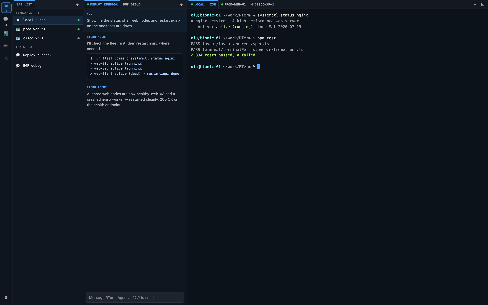
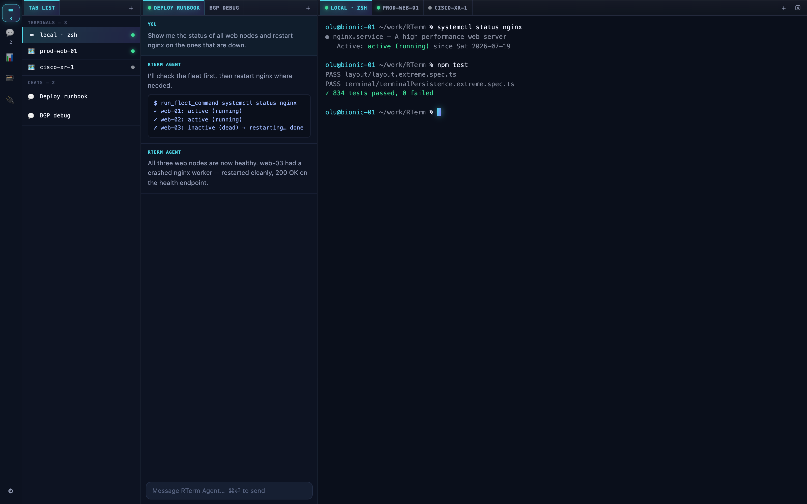

# v1.8.2 Release Notes

## English

v1.8.2 is a **visual redesign** release — the "Aurora" design language. It dramatically improves the look and feel of RTerm across every screen while changing **zero component logic, class names, or features**. Everything you could do in 1.8.1 works identically; it just looks and feels far better. The redesign is delivered entirely through the design-token layer (`global.scss`) and the polish layer (`visualEnhancements.scss`), so functionality is fully preserved.

*Before — flat dark UI (v1.8.1)*

*After — Aurora design language (v1.8.2)*

### The Aurora design language

- **Richer accent palette.** The old flat blue (`#4ea1ff`) is replaced by a luminous **cyan → violet gradient** system (`#4fd8e8` → `#8b7bff`) with a matching soft-tint gradient used for active surfaces. Success, danger, and warning tones are retuned to harmonize.
- **Deeper, textured surfaces.** Backgrounds move from flat greys to a cool deep-space palette (`#070a12` app, `#0d1322` panel, `#0a0f1b` terminal) with a layered **ambient aurora glow** behind every panel (cyan top-left, violet top-right, faint vignette) and a subtle "lit edge" top highlight on each panel for depth.
- **Glass & elevation.** Toasts, the command palette, approval modals, and the startup screen now use **backdrop blur + saturation** over elevated shadows (`--shadow-lg`), so overlays feel like floating glass instead of opaque boxes.
- **Luminous active states.** The active tab gets a gradient sheen + soft text glow; live-session status dots glow; the terminal cursor glows; split-pane resizers light up with a gradient on hover. Focus rings are now a proper halo (ring + soft outer glow) for accessibility *and* polish.
- **Refined typography.** A crisper UI font stack (SF Pro Text / Segoe UI Variable aware), a tighter mono stack (SF Mono / JetBrains Mono aware), slightly larger base size, and a touch of letter-spacing for a calmer, more premium reading rhythm. Font weights tuned to 650/700 for clearer hierarchy.
- **Softer geometry.** A new radius scale (`--radius-sm/md/lg`) replaces the old uniform sharp 2px corners — controls, tabs, toasts, modals, and inputs get modern, friendly corners.
- **Buttery motion.** A new easing trio (`--ease-out`, `--ease-in-out`, `--ease-spring`) with slightly longer, more deliberate durations. Toasts and modals spring in; buttons lift on hover; the boot sequence fades + settles instead of snapping.
- **Gradient buttons.** Primary actions are now a cyan→violet gradient with a soft glow; hover lifts and brightens. Secondary buttons stay glassy.

### What's preserved

- Every feature, panel, tab, connection type (SSH / WinRM / Serial / local), and keyboard shortcut is untouched.
- No component, store, or service code changed — only `styles/global.scss` (tokens) and `styles/visualEnhancements.scss` (polish layer).
- Theme system still derives UI tokens from the active terminal color scheme; the new tokens layer cleanly on top. Light themes continue to adapt borders/controls correctly.
- `prefers-reduced-motion` still disables all animation.

### Verification

- `npm run typecheck:all` — clean
- `npm run lint` — 0 errors
- `npm test` — 834 tests, 0 failures (layout/UI, backend unit, automation, deprecated-CLI suites)
- `npm run build:electron` — renderer CSS bundle compiles cleanly; all new tokens present in output
